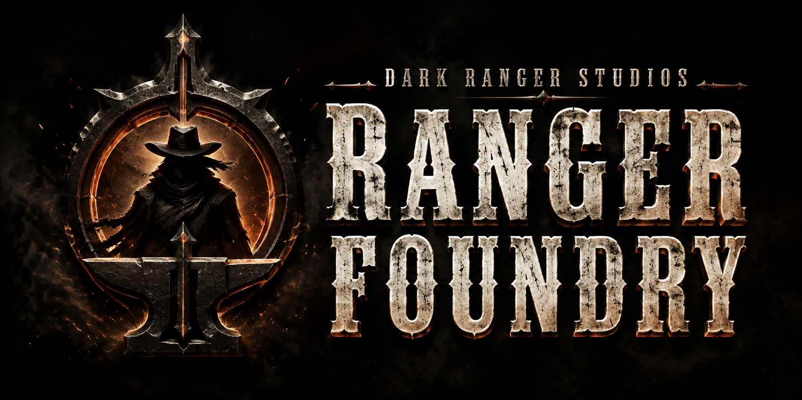

# Ranger Foundry

## Build cool shit. Check your work.

AI can write a lot of code in a hurry. Then you get to find out what it missed,
why it changed six other things, and whether “all tests pass” means anyone
actually tried using it.

Ranger Foundry is a toolbelt for that part of the job.

Ten skills for AI coding agents: **Marshal**, the foreman who keeps a bigger job moving, and
nine specialists for figuring things out, planning the work, building a small
experiment, finding trouble, and handing things over without losing the plot.

The idea is pretty simple: understand the job, build it in pieces you can check,
have someone challenge the work, and leave enough evidence that the next person
doesn't have to take your word for it.

**Built by Dark Ranger Studios. Open source. Bring your own agents.**

[Meet the posse](#meet-the-posse) · [Put it to work](#put-it-to-work) · [Install](#install)

---

## Meet the posse

You can call a specialist directly. You don't need a whole production line to
fix a loose screw. Each Ranger uses its callsign as its skill name: `ranger-marshal`,
`ranger-bounty-hunter`, and so on. The shared `ranger-` prefix keeps the posse together
in the skill menu.

| Skill | What you call it in for |
| --- | --- |
| **Marshal** · Assembly Line · `ranger-marshal` | Keep a bigger job moving from the initial ask through review, testing, and handoff. Bring in the right specialist along the way. |
| **Bounty Hunter** · Cause Analysis · `ranger-bounty-hunter` | Find what actually broke. Follow the evidence back to the cause before changing things. |
| **Warden** · Agent Instructions · `ranger-warden` | Sort out the rule files when your agents are getting mixed signals. |
| **Trailblazer** · Slice Plan · `ranger-trailblazer` | Break a big idea into useful pieces you can build and verify one at a time. |
| **Deadeye** · Plan Assurance · `ranger-deadeye` | Poke holes in the plan while changing it is still cheap. |
| **Courier** · Handoff · `ranger-courier` | Leave the next person the actual state of the work: what's done, what's stuck, and where to pick up. |
| **Prospector** · Questionnaire · `ranger-prospector` | Ask the questions that change what gets built. Stop when there's enough to work with. |
| **Sparks** · Prototype · `ranger-sparks` | Try the smallest useful version and see whether the idea holds up. |
| **Raven** · Swarm Coordination · `ranger-raven` | Keep agents informed, route direct review requests, and recover unfinished work without crossing task lanes. |
| **Kestrel** · Review · `ranger-kestrel` | Hunt for bugs, security gaps, and claims the evidence doesn't support. |

## Put it to work

Give the agent a real job and a clear boundary. For example:

> Use $ranger-bounty-hunter to find out why saved settings disappear after a
> restart. Show me the cause and how you proved it. Don't change the code yet.

Or, once you're ready to build:

> Use $ranger-marshal to implement the approved fix. Follow this repo's
> rules, test the failure we started with, and leave a handoff. No deployment.

The agent reads the relevant skill instructions and applies them. There isn't a
hidden crew of services running behind the scenes. Assembly Line keeps the job
together; your repository's design, implementation, database, and release rules
still govern the work.

Small, reversible jobs get a short path. Work across several files gets a plan
and regression checks. Auth, secrets, data migrations, production changes, and
other high-risk work need tighter checks, a recovery plan, and an independent
reviewer in a separate agent context or a human.

Raven uses your existing authorized communication channel. It does not install a
message service. Callsigns, transport addresses, and task lanes stay separate;
broadcast receipts are not review acceptance.

### Who gets the keys?

You do. Installing a skill doesn't give an agent permission to publish your
code, spend money, change production, or send messages on your behalf.

Before any commit, push, merge, promotion, platform save, deployment, or
publication, check two things: is this exact action authorized, and is this exact
version eligible for its destination? A plan, passing tests, broad authorization,
or a phase change doesn't answer both questions. A review of yesterday's code
doesn't cover today's changes.

Record the remote, full ref, pushed revision, whether the push was forced, and the
server-observed resulting tip. Pushing source, saving a platform version, and
deploying it each need their own gates.

These are instructions for the agent. **Keep the real locks in place:** host
permissions, branch protection, and deployment controls.

## Bring your own workshop

Keep shared project rules in `AGENTS.md`. Use thin adapters for each agent instead
of maintaining five slightly different copies of the same rules.

The [platform adapter guide](docs/platform-adapters.md) covers discovery and
setup patterns for Claude Code, GitHub Copilot, Visual Studio Code, Cursor, and
Grok Build. The Codex plugin install is below.

Keep your company's infrastructure details, credentials, and private workflows
in your own overlays. The public skills are meant to travel. Your private
context isn't. Repository rules and private overlays take precedence; see
[Dispatch policy](docs/dispatch-policy.md).

## Install

Add the marketplace, then the plugin:

```bash
codex plugin marketplace add darkrangerstudios/ranger-foundry --ref v0.3.0
codex plugin add ranger-foundry@ranger-foundry
```

Pin a reviewed tag or exact commit. Start a fresh Codex task after installation
so it loads the new skills. Upgrading from v0.2.x? Follow the
[skill-name migration](docs/skill-name-migration.md) to replace the old role-based
commands and avoid duplicate menu entries.

### Make it earn its place

Try Foundry alongside your current workflow before handing it the whole shop.
The [commissioning guide](docs/commissioning.md) starts with three real jobs:
compare independent runs, record what each one caught or missed, and get a
Kestrel verdict from a separate reviewer context or human. Track regressions and how much babysitting each run needed.

If the candidate misses something serious, fix it and do the required follow-up
trials. Keep your established workflow until the evidence supports a deliberate
switch. A clean install is just a clean install.

## Check the package

From the repository root:

```bash
python3 -I scripts/validate.py
```

No dependencies to install. The validator checks the plugin structure, exact
skill list, metadata, declared routing cases, and public-content boundaries.
It rejects unexpected files, executable content, and symbolic links; the one
reviewed banner is allowed only at its exact path and byte hash. Its original
generation provenance is retained; see the [artwork review](docs/artwork.md).

It doesn't run an agent. Real-world behavior still has to be tested on the
platform where you plan to use it.

## Under the hood

```text
.agents/plugins/marketplace.json
plugins/ranger-foundry/
  .codex-plugin/plugin.json
  skills/
assets/ranger-foundry-dark-west.png
docs/
evals/routing-cases.json
scripts/validate.py
```

Each skill has a `SKILL.md` and an `agents/openai.yaml` file.

## Got a better way?

Bring a focused change and show what it improves. Start with
[Contributing](CONTRIBUTING.md) and [Skill review](docs/skill-review.md).
For security issues, use the private reporting channel in
[Security](SECURITY.md).

Ranger Foundry is released under the [MIT License](LICENSE).
